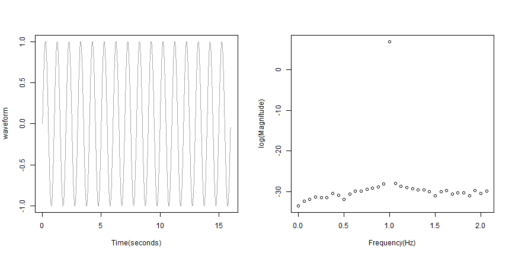
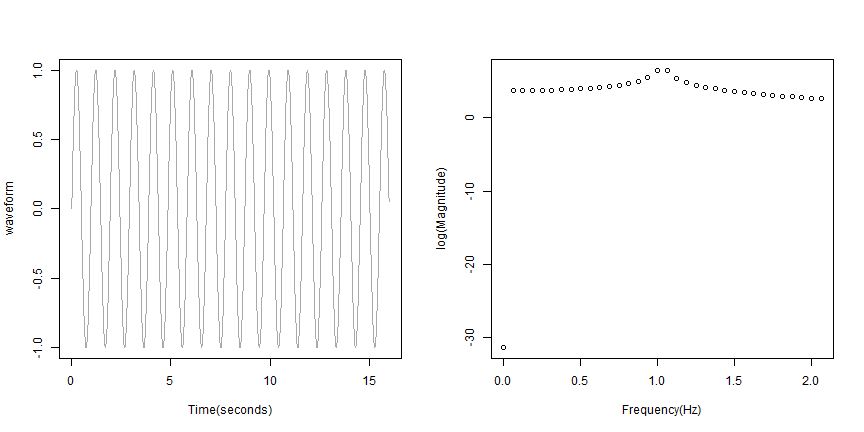
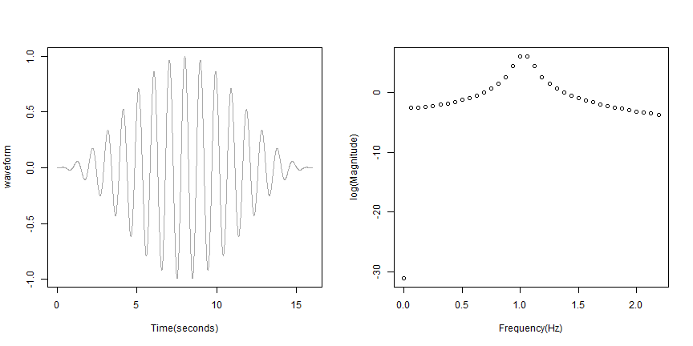

## Spectral Leakage

**Fourier Analysis** 
- Waveform approximated by sums of sinusoids
- Important tool with time series analysis 
- FFT digital implementation (fft() in R)
- Assumes sequence repeats (i.e. is periodic) - often leads to discontinuity
- Windowing used to handle the resulting "spectral leakage"

(Adapted from Maxim website)

See http://mbjengineering.shinyapps.io/runApp/ to explore these concepts further. 

--- .class #id 

## Ideal Situation (pure sinusoid with no waveform discontinuity)

Over30 db difference between fundamental frequency and surrounding frequencies
 
 

--- .class #id 

## Discontinuity - pure sinusoid with discontinuity

The fundamental frequency difficult to visualize.

 

--- .class #id 

## Windowing - pure sinusiod with discontinuity and Hanning Window Applied

The fundamental is visible with approx. a 10 db decrease in surrounding frequencies.

 
